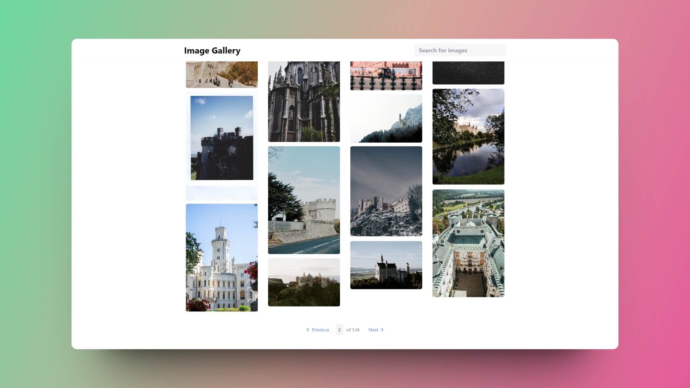

  
#  🔺 Next.js - Image Gallery

### Galería de imágenes.

> 🧩 Aquí puedes ver su [**Live Demo.**](https://image-gallery-abraham.vercel.app/)

## 🚀 Descripción

Este proyecto permite buscar dentro de una galería de imágenes.

Y renderiza las imágenes a traves de la **API** de **Pexels**.

## 🎭 Tecnologías

El proyecto utiliza las siguientes tecnologías:

- **Zod** para validar con TypeScript.
- **Envalid** para acceder a variables de entorno en Node.js.
- **TailwindCSS** para crear una [**Masonry grid layout**](https://developer.mozilla.org/en-US/docs/Web/CSS/CSS_grid_layout/Masonry_layout), al mostrar las imágenes de búsquedas con solo **CSS** **sin utilizar JavaScript.**
